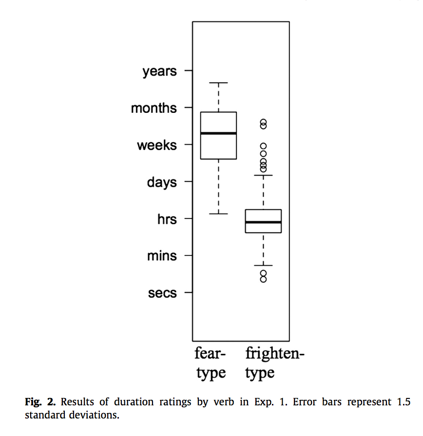

#### Article ID: MbLKW
#### Pilot: Cai Guo
#### Co-pilot: Tom Hardwicke  
#### Start date: Mar 12 2017
#### End date: Mar 16 2017
#### Final verification: Tom Hardwicke
#### Date: Nov 9 2017

-------

#### Methods summary:

The original authors recruited participants from an online resource and disseminated the materials on the same online platform. Specifically, 48 participants completed a survey where they first read sentences containing fear-type and frighten-type verbs and then completed questions asking about how long they thought the mental state, indicated by the verb in each sentence, would last.

------

#### Target outcomes: 

> The participants’ answers were converted to a 7-point Likert scale for analysis. Participants judged the mental state described in fear-type verbs to last significantly longer than those described by frighten-type verbs (t(256) = 19.9, p < 0.001) (Fig. 2). 18 of the fear-type verbs (42%) were judged to have longer durations than any of the frighten-type verbs, and 153 of the frighten-type verbs (71%) were judged to have shorter durations than any of the fear-type verbs.

------

```{r global_options, include=FALSE}
knitr::opts_chunk$set(echo=TRUE, warning=FALSE, message=FALSE)

# prepare an empty report object, we will update this each time we run compareValues2()
reportObject <- data.frame("Article_ID" = NA, "valuesChecked" = 0, "eyeballs" = 0, "Total_df" = 0, "Total_p" = 0, "Total_mean" = 0, "Total_sd" = 0, "Total_se" = 0, "Total_ci" = 0, "Total_bf" = 0, "Total_t" = 0, "Total_F" = 0, "Total_es" = 0, "Total_median" = 0, "Total_irr" = 0, "Total_r" = 0, "Total_z" = 0, "Total_coeff" = 0, "Total_n" = 0, "Total_x2" = 0, "Total_other" = 0, "Insufficient_Information_Errors" = 0, "Decision_Errors" = 0, "Major_Numerical_Errors" = 0, "Minor_Numerical_Errors" = 0, "Major_df" = 0, "Major_p" = 0, "Major_mean" = 0, "Major_sd" = 0, "Major_se" = 0, "Major_ci" = 0, "Major_bf" = 0, "Major_t" = 0, "Major_F" = 0, "Major_es" = 0, "Major_median" = 0, "Major_irr" = 0, "Major_r" = 0, "Major_z" = 0, "Major_coeff" = 0, "Major_n" = 0, "Major_x2" = 0, "Major_other" = 0, "affectsConclusion" = NA, "error_typo" = 0, "error_specification" = 0, "error_analysis" = 0, "error_data" = 0, "error_unidentified" = 0, "Author_Assistance" = NA, "resolved_typo" = 0, "resolved_specification" = 0, "resolved_analysis" = 0, "resolved_data" = 0, "correctionSuggested" = NA, "correctionPublished" = NA)
```

## Step 1: Load packages

Some useful packages are being loaded below.

```{r}
library(tidyverse) # for data munging
library(knitr) # for kable table formating
library(haven) # import and export 'SPSS', 'Stata' and 'SAS' Files
library(readxl) # import excel files
library(CODreports) # custom report functions
```

## Step 2: Load data

```{r}
d <- read.csv("data/data.csv")
```

## Step 3: Tidy data

```{r}
d_tidy <- d %>%
  select(Type, word, Duration) %>%
  mutate(Type = recode(Type, "SO" = "fear", "SS" = "frighten"))
```

## Step 4: Run analysis

### Descriptive statistics

The descriptive statistics are mainly in Figure 2 of the original paper:


Let's try to reproduce it:

```{r}
boxplot(Duration~Type, data=d_tidy, main="Type of Verbs and Perceived Duration", xlab="Type of Verb", ylab="Duration", ylim= c(1,7), names= c("Fear-Type", "Frighten-Type"), boxwex=0.4, par(mar=c(2,10,2,10)))
```

```{r}
meds <- d_tidy %>% group_by(Type) %>% summarise(Md = median(Duration))
md1 <- meds %>% filter(Type == 'fear') %>% pull(Md)
md2 <- meds %>% filter(Type == 'frighten') %>% pull(Md)

reportObject <- compareValues2(reportedValue = "eyeballMATCH", obtainedValue = md1, valueType = 'median')
reportObject <- compareValues2(reportedValue = "eyeballMATCH", obtainedValue = md2, 'median')
```
Looks good.

The article states that:
> 18 of the fear-type verbs (42%) were judged to have longer durations than any of the frighten-type verbs

Let's try to reproduce that:

```{r}
fear <- filter(d_tidy, Type == "fear")$Duration
frighten <- filter(d_tidy, Type == "frighten")$Duration

#the number of fear-type verbs that have higher duration than any of the frighten-type verb
n1 <- sum(fear > max(frighten)) 
percent1 <- n1/length(fear) # percentage
```

Check discrepancies and report errors:
```{r}
reportObject <- compareValues2(reportedValue = "18", obtainedValue = n1, valueType = 'n')
reportObject <- compareValues2(reportedValue = ".42", obtainedValue = percent1, valueType = 'n')
```

The article states that:
> 153 of the frighten-type verbs (71%) were judged to have shorter durations than any of the fear-type verbs.

Let's try to reproduce that:
```{r}
# the number of frighten-type verbs that have lower duration than any of the fear-type verb
n2 <- sum(frighten < min(fear)) 
percent2 <- n2/length(frighten) # percentage
```

Check discrepancies and report errors:

```{r}
reportObject <- compareValues2(reportedValue = "153", obtainedValue = n2, valueType = 'n')
reportObject <- compareValues2(reportedValue = ".71", obtainedValue = percent2, 'n')
```

### Inferential statistics

The original article reports a t-test:

> Participants judged the mental state described in fear-type verbs to last significantly longer than those described by frighten-type verbs (t(256) = 19.9, p < 0.001)

Let's try to reproduce that:

```{r}
t.out <- t.test(fear,frighten, var.equal = T)
```

```{r}
reportObject <- compareValues2(reportedValue = "256", obtainedValue = t.out$parameter, valueType = 'df') # compare dfs
reportObject <- compareValues2(reportedValue = "19.9", obtainedValue = t.out$statistic, valueType = 't') # compare t-values
reportObject <- compareValues2(reportedValue = "eyeballMATCH", obtainedValue = t.out$p.value, valueType = 'p') # compare p-values
```

## Step 5: Conclusion

Except for a few minor discrepancies, the target outcomes under investigation were reproduced successfully. Specifically, the reported results from the t-test and the boxplot in the original paper very closely matched the values obtained in the current reproduction attempt. 


```{r}
reportObject$Article_ID <- "MbLKW"
reportObject$affectsConclusion <- NA
reportObject$error_typo <- 0
reportObject$error_specification <- 0
reportObject$error_analysis <- 0
reportObject$error_data <- 0
reportObject$error_unidentified <- 0
reportObject$Author_Assistance <- F
reportObject$resolved_typo <- 0
reportObject$resolved_specification <- 0
reportObject$resolved_analysis <- 0
reportObject$resolved_data <- 0
reportObject$correctionSuggested <- NA
reportObject$correctionPublished <- NA

# decide on final outcome
if(reportObject$Decision_Errors > 0 | reportObject$Major_Numerical_Errors > 0 | reportObject$Insufficient_Information_Errors > 0){
  reportObject$finalOutcome <- "Failure"
  if(reportObject$Author_Assistance == T){
    reportObject$finalOutcome <- "Failure despite author assistance"
  }
}else{
  reportObject$finalOutcome <- "Success"
  if(reportObject$Author_Assistance == T){
    reportObject$finalOutcome <- "Success with author assistance"
  }
}

# save the report object
filename <- paste0("reportObject_", reportObject$Article_ID,".csv")
write_csv(reportObject, filename)
```

## Report Object

```{r, echo = FALSE}
# display report object in chunks
kable(reportObject[2:10], align = 'l')
kable(reportObject[11:20], align = 'l')
kable(reportObject[21:25], align = 'l')
kable(reportObject[26:30], align = 'l')
kable(reportObject[31:35], align = 'l')
kable(reportObject[36:40], align = 'l')
kable(reportObject[41:45], align = 'l')
kable(reportObject[46:51], align = 'l')
kable(reportObject[52:57], align = 'l')
```

## Session information

```{r session_info, include=TRUE, echo=TRUE, results='markup'}
devtools::session_info()
```
