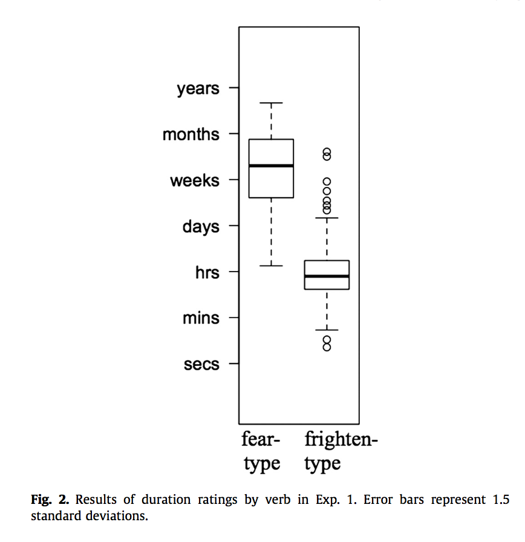

#### Article ID: MbLKW
#### Pilot: Cai Guo
#### Co-pilot: Tom Hardwicke  
#### Start date: 03/12/2017
#### End date: 03/16/2017

-------

#### Methods summary:

The original authors recruited participants from an online resource and disseminated the materials on the same online platform. Specifically, 48 participants completed a survey where they first read sentences containing fear-type and frighten-type verbs and then completed questions asking about how long they thought the mental state, indicated by the verb in each sentence, would last.

------

#### Target outcomes: 

> The participants’ answers were converted to a 7-point Likert scale for analysis. Participants judged the mental state described in fear-type verbs to last significantly longer than those described by frighten-type verbs (t(256) = 19.9, p < 0.001) (Fig. 2). 18 of the fear-type verbs (42%) were judged to have longer durations than any of the frighten-type verbs, and 153 of the frighten-type verbs (71%) were judged to have shorter durations than any of the fear-type verbs.

------

```{r global_options, include=FALSE}
knitr::opts_chunk$set(echo=TRUE, warning=FALSE, message=FALSE)
```

## Step 1: Load packages

Some useful packages are being loaded below.

```{r}
library(tidyverse) # for data munging
library(knitr) # for kable table formating
library(haven) # import and export 'SPSS', 'Stata' and 'SAS' Files
library(readxl) # import excel files
library(CODreports) # custom report functions
```

## Step 2: Load data

```{r}
d <- read.csv("data/data.csv")
```

## Step 3: Tidy data

```{r}
d_tidy <- d %>%
  select(Type, word, Duration) %>%
  mutate(Type = recode(Type, "SO" = "fear", "SS" = "frighten"))
```

## Step 4: Run analysis

### Descriptive statistics

The descriptive statistics are mainly in Figure 2 of the original paper:


Let's try to reproduce it:

```{r}
print(boxplot(Duration~Type, data=d_tidy, main="Type of Verbs and Perceived Duration", xlab="Type of Verb", ylab="Duration", ylim= c(1,7), names= c("Fear-Type", "Frighten-Type"), boxwex=0.4, par(mar=c(2,10,2,10))))
```

The article states that:
> 18 of the fear-type verbs (42%) were judged to have longer durations than any of the frighten-type verbs

Let's try to reproduce that:

```{r}
fear <- filter(d_tidy, Type == "fear")$Duration
frighten <- filter(d_tidy, Type == "frighten")$Duration

#the number of fear-type verbs that have higher duration than any of the frighten-type verb
n1 <- sum(fear > max(frighten)) 
percent1 <- n1/length(fear) # percentage
```

Check discrepancies and report errors:
```{r}
compareValues(reportedValue = 18, obtainedValue = n1)
compareValues(reportedValue = .42, obtainedValue = percent1)
```

The article states that:
> 153 of the frighten-type verbs (71%) were judged to have shorter durations than any of the fear-type verbs.

Let's try to reproduce that:
```{r}
# the number of frighten-type verbs that have lower duration than any of the fear-type verb
n2 <- sum(frighten < min(fear)) 
percent2 <- n2/length(frighten) # percentage
```

Check discrepancies and report errors:

```{r}
compareValues(reportedValue = 153, obtainedValue = n2)
compareValues(reportedValue = .71, obtainedValue = percent2)
```

### Inferential statistics

The original article reports a t-test:

> Participants judged the mental state described in fear-type verbs to last significantly longer than those described by frighten-type verbs (t(256) = 19.9, p < 0.001)

Let's try to reproduce that:

```{r}
t.out <- t.test(fear,frighten, var.equal = T)
t.out
```

```{r}
compareValues(reportedValue = 19.9, obtainedValue = t.out$statistic) # compare t-values
```

## Step 5: Conclusion

Except for a few minor discrepancies that are likely due to rounding differences, the project under investigation was reproduced successfully. Specifically, the reported results from the t-test and the boxplot in the original paper approximately matched the values obtained in the current reproduction attempt. 

```{r report}
codReport(Report_Type = 'joint',
          Article_ID = 'MbLKW', 
          Insufficient_Information_Errors = 0,
          Decision_Errors = 0, 
          Major_Numerical_Errors = 0, 
          Minor_Numerical_Errors = 5)
```

This function will output information about the package versions used in this report:

```{r session_info, include=TRUE, echo=TRUE, results='markup'}
devtools::session_info()
```
